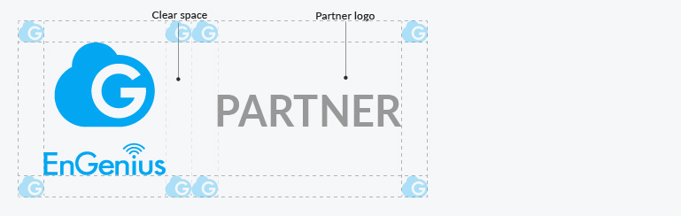
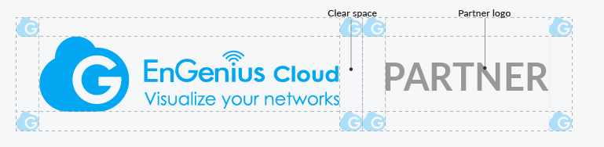
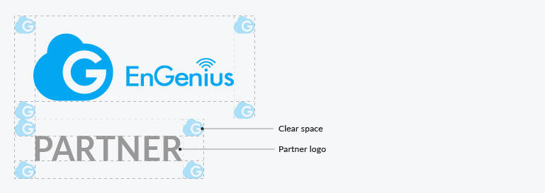

# 4. Co-branding 企業合作

### Partnership lockup 組合規範

The partnership lockup is used for communication around approach EnGenius partnerships. Please follow the rules below when EnGenius cooperates with other brands, the size ratio, position, and clearing space configuration of Partner Logo.

### Partnership Lockup - Horizontal 水平排版

### Partnership Lockup - Vertical 垂直排版

