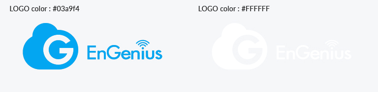

# 2. Color 顏色

### Principle 使用原則

1. The EnGenius Cloud logo is always either blue or white 
2. When placing the logo on an image or color-ed background, always use the white version. 
3. There may be some exceptions to the rule. Please reach out for permission.

### Color Style 顏色版本

Blue version 藍字版  
White version反白版

  
White background 白色背景  
Blue background 藍色背景

Black background 黑色背景  
Image background 圖像背景

