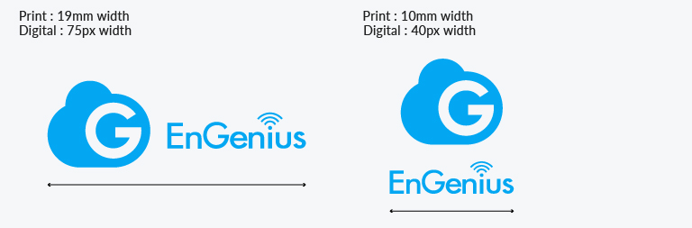
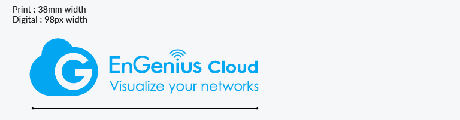
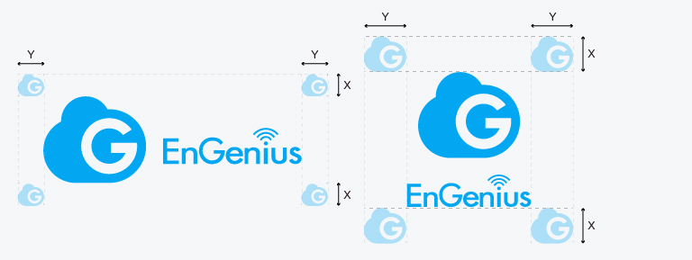

# 1. Logo 識別標誌

### Standard Ratio  標準比例

#### VerticalLockup 直式排版

#### HorizontalLockup 橫式排版

#### Horizontal Lockup with tagline 橫式排版加標語

### 

### Minimum Size 最小尺寸 

#### VerticalLockup 直式排版

* Digital數位版 - 40px in width
* Print 印刷版- 10mm in width

#### HorizontalLockup 橫式排版

* 數位版 Digital - 75px in width
* 印刷版 Print - 19mm in width

#### 

#### Horizontal Lockup with tagline 橫式排版加標語

* 數位版 Digital - 98px in width
* 印刷版 Print - 38mm in width

### 

### Clear Spacing 淨空範圍

