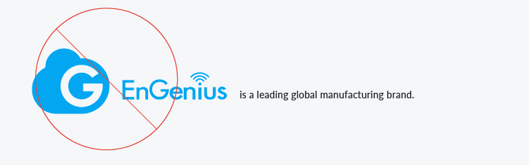

# 3. Misuse錯誤範例

### 3.1 錯誤範例

* Do not alter the proportions of the Cloud logo
* Do not use any color other than the official black
* Do not outline the Cloud logo
* Do not display the Cloud logo at any angle
* Do not create the Cloud logo in the wrong font
* Do not display the Cloud logo within a little


請將敘述標的文字改為EnGenius


>

