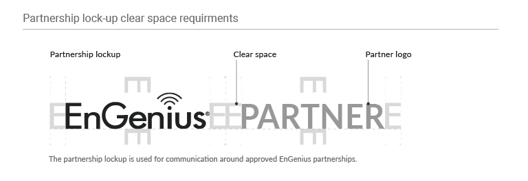

# 5. Co-branding 企業合作

### Partnership lockup 組合規範

The partnership lockup is used for communication around approach EnGenius partnerships. Please follow the rules below when EnGenius cooperates with other brands, the size ratio, position, and clearing space configuration of Partner Logo.

合作夥伴Logo的組合設計與陳列旨在溝通傳達EnGenius與企業的合作關係。當EnGenius與其他品牌合作時，請遵照以下Partner Logo的大小比例、位置與淨空範圍配置。  

### Horizontal Display 橫式陳列

The partnership lockup is used for communication around approach EnGenius partnerships.

### 

### Vertical Display  直式陳列

