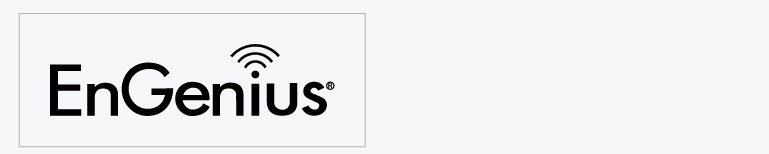
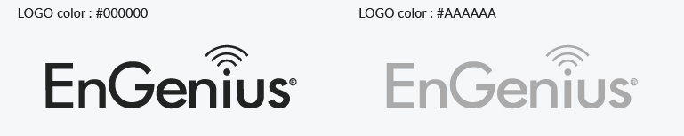

# 2.  Color 顏色

### Principle 使用原則

1. The EnGenius logo is always either black, white, or gray 
2. When placing the logo on an image or color-ed background, always use the white version. 
3. There may be some exceptions to the rule. Please reach out for permission.

### Color Style 顏色版本

Black version 黑字版

White version 白字版

### 

### Color usage of the logo 配色使用規範

White or transparent background 白色或透明背景

Black, color-ed, or image background 黑色、彩色或底圖背景

### 

\*\*\*\*

