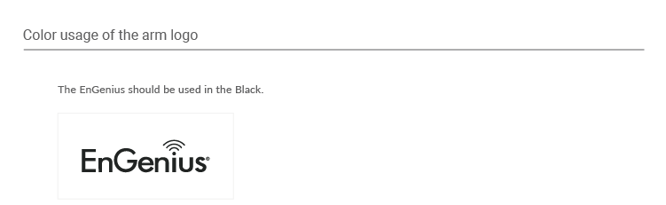

# 2.  Color 顏色

### 2.1 Logo顏色

* The EnGenius logo is always either black or white. 
* When placing the logo on an image, always use the white version. 
* There may be some exceptions to the rule. Please reach out for permission.

* 標準版
* 反白版

### 2.2 背景規範

* 黑色背景
* 白色背景
* 彩色背景
* 其他背景

### 2.3 其他樣式

\*\*\*\*

