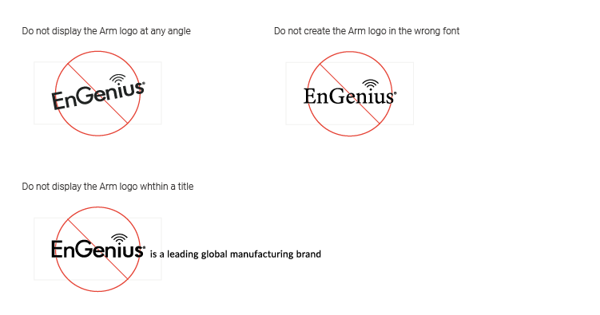

# 4.  Misuse 錯誤範例

### 4.1 錯誤範例

* Do not alter the proportions of the EnGenius logo
* Do not use any color other than the official black
* Do not outline the EnGenius logo
* Do not display the EnGenius logo at any angle
* Do not create the EnGenius logo in the wrong font
* Do not display the EnGenius logo within a little

