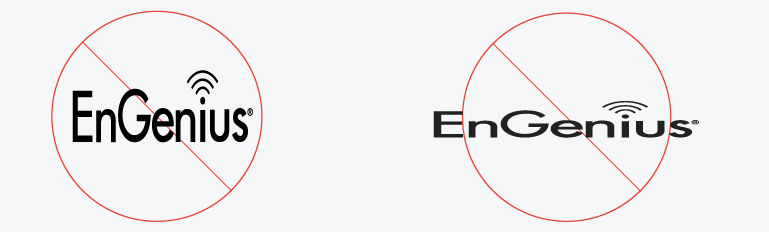
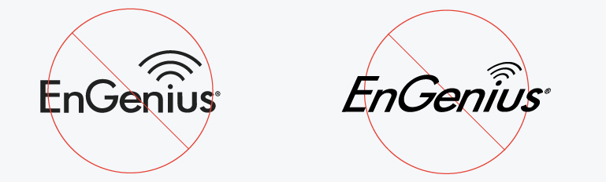
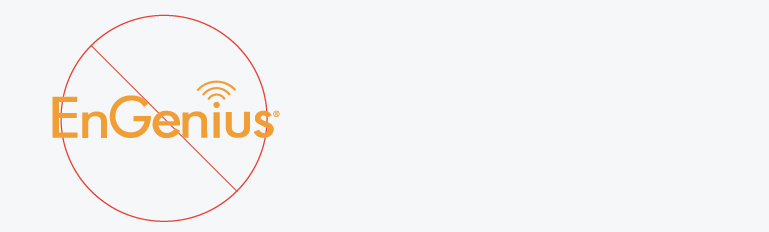
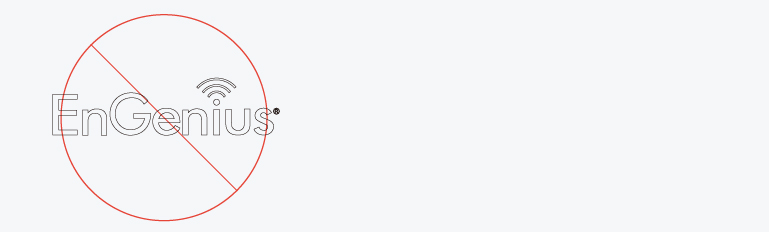
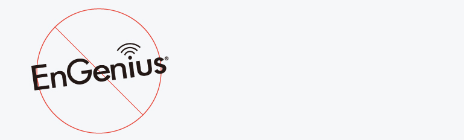
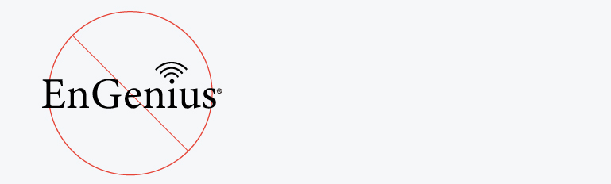
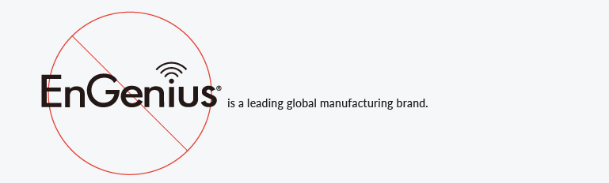

# 4.  Misuse 錯誤範例

1. Do not alter the proportions of the EnGenius logo  
1. 請勿改變logo圖像的長寬比例 

2. Do not use any color other than the official black, gray, or white  
2. 請勿使用官方所訂定黑、白、灰以外之顏色

3. Do not outline the EnGenius logo  
3. 請勿在logo文字上加外框線條

4. Do not display the EnGenius logo at any angle  
4. 請勿以任一角度旋轉logo圖像

5. Do not create the EnGenius logo in the wrong font  
5. 請勿使用錯誤的字型重製EnGenius logo

6. Do not display the EnGenius logo within a little  
6. 請勿在logo之後加上其他文字

