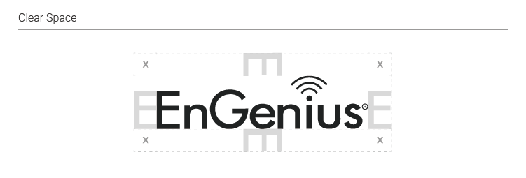

# 1. Logo 識別標誌

### ~~1.1 **核心視覺元素 Core Element**~~

### 1.1 基本規範 The Basics

1.1.1 Principles 使用原則

1.1.2 Core Element核心元素  
插畫、影像與輔助圖形  
Logo與Icon


 ...請補上說明圖?


### **1.2 尺寸 Size**

1.2.1  最大尺寸 Maximum size 

* 數位版 Digital 
* 印刷版 Print 


請補上尺寸數字


1.2.1  最小尺寸 Minimum size 

* 數位版 Digital - 60px in width
* 印刷版 Print - 22mm in width

### 1.3 淨空範圍 Spacing 

