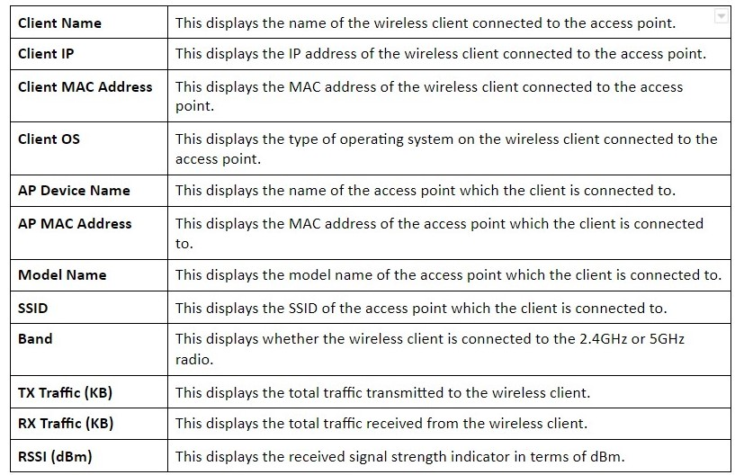

# Active Clients

From here, users can view wireless client information, temporarily disconnect, and permanently block the wireless clients that are associated with the access points managed by EWS switch. In addition, EWS switch is capable to identify client devices by their operating system, device type and host name when client devices are using DHCP. If multiple access points are within the same network, please use the search bar to find the specific access point by its name or MAC address.  

<table>
  <thead>
    <tr>
      <th style="text-align:left">Items</th>
      <th style="text-align:left">Functions</th>
      <th style="text-align:left">Descriptions</th>
    </tr>
  </thead>
  <tbody>
    <tr>
      <td style="text-align:left">
        
      </td>
      <td style="text-align:left"><b>Kick Client               </b>
      </td>
      <td style="text-align:left"><b>Use this function to temporarily disconnect a wireless client from the WLAN. The disconnected client can simply reconnect manually if they wish to.</b>
         
      </td>
    </tr>
    <tr>
      <td style="text-align:left">
        
&lt;b&gt;&lt;/b&gt;

        

          
        

      </td>
      <td style="text-align:left"><b>Search Bar</b>
      </td>
      <td style="text-align:left"><b>Use the Search Bar to search for wireless clients managed by the EWS switch using the following criteria: Client Name, Client IP, Client MAC Address, Client OS, AP Device Name, AP MAC Address, Model Name, SSID, Band, TX Traffic, RX Traffic.</b>
      </td>
    </tr>
  </tbody>
</table>

  

